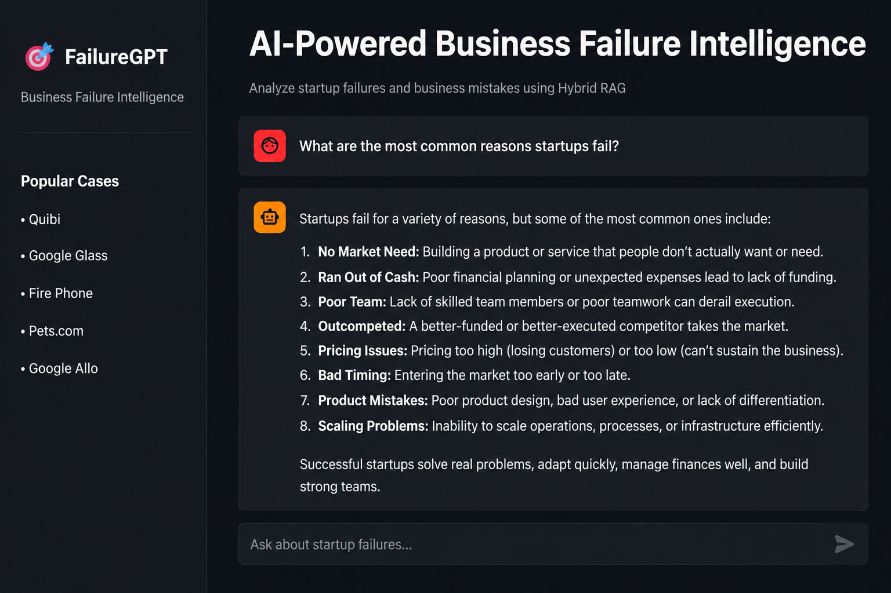

# 🎯 AI-Powered Business Failure Intelligence

FailureGPT is a Hybrid Retrieval-Augmented Generation (Hybrid RAG) application designed to analyze startup failures, product shutdowns, and business collapses using Artificial Intelligence.

The system combines Semantic Search (FAISS) and Keyword Search (BM25) to retrieve highly relevant business failure case studies and generate actionable insights using Google's Gemini AI.

---

## 📸 Application Dashboard



---

## 🚀 Project Overview

Business failures contain valuable lessons for founders, entrepreneurs, product managers, and business leaders.

FailureGPT helps users:

- Analyze startup failures
- Understand key failure drivers
- Learn strategic business lessons
- Identify recurring failure patterns
- Compare failed companies
- Generate actionable recommendations

---

## 📊 Dataset Statistics

| Metric | Value |
|----------|----------|
| Business Failure Case Studies | 41 |
| Knowledge Chunks Generated | 188 |
| Retrieval Method | Hybrid RAG |
| Vector Database | FAISS |
| Keyword Search | BM25 |
| LLM | Gemini 2.5 Flash |

---

## ✨ Key Features

### 🔍 Hybrid RAG Retrieval

Combines:

- FAISS Vector Search
- BM25 Keyword Search

for improved retrieval accuracy and context relevance.

### 🤖 AI-Powered Business Analysis

Generates:

- Executive Summary
- Failure Reasons
- Business Impact
- Lessons Learned
- Strategic Recommendations
- Similar Failure Cases

### 💬 Conversational Chat Interface

Users can interact naturally and ask questions such as:

- Why did Quibi fail?
- Why did Fire Phone fail?
- Compare Quibi and Pets.com
- What are the most common startup failure reasons?

### 📚 Business Failure Knowledge Base

Built on real-world startup and product failure case studies stored in structured JSON datasets.

---

## 🏗️ System Architecture

```text
User Query
     │
     ▼
Hybrid Retrieval
 ├── FAISS Search
 └── BM25 Search
     │
     ▼
Context Generation
     │
     ▼
Gemini AI
     │
     ▼
Business Failure Analysis
```

---

## ⚙️ Tech Stack

### Frontend

- Streamlit

### AI & LLM

- Google Gemini 2.5 Flash

### Retrieval

- FAISS
- BM25

### Frameworks

- LangChain

### Embeddings

- Sentence Transformers
- all-MiniLM-L6-v2

### Programming Language

- Python

---

## 📂 Project Structure

```text
AI-Powered-Business-Failure-Intelligence
│
├── datasets/
│   ├── quibi.json
│   ├── fire_phone.json
│   ├── google_glass.json
│   └── ...
│
├── Dashboard.png
├── app.py
├── hybrid_app.py
├── build_vector_db.py
├── requirements.txt
└── README.md
```

---

## 🔄 Project Workflow

### Step 1: Data Collection

Collected and organized 41 real-world business failure case studies in JSON format.

### Step 2: Document Processing

Documents are:

- Loaded
- Cleaned
- Chunked into smaller segments

### Step 3: Embedding Generation

Text embeddings are generated using:

```python
sentence-transformers/all-MiniLM-L6-v2
```

### Step 4: Vector Database Creation

Embeddings are indexed and stored using FAISS.

### Step 5: Hybrid Retrieval

User queries are processed using:

- Semantic Search (FAISS)
- Keyword Search (BM25)

The retrieved results are merged to improve relevance.

### Step 6: AI Response Generation

Retrieved context is sent to Gemini AI to generate structured business analysis.

### Step 7: User Interaction

Results are displayed through an interactive chat-based interface.

---

## 🧪 Example Questions

### Startup Analysis

- Why did Quibi fail?
- Why did Fire Phone fail?
- Why did Google Glass fail?
- Why did Google Allo fail?

### Comparison Analysis

- Compare Quibi and Pets.com
- Compare Vine and TikTok
- Compare Fire Phone and Google Glass

### Business Intelligence

- What are the most common startup failure reasons?
- What lessons can founders learn from failed startups?
- Which failures were caused by poor product-market fit?

---

## 🎯 Business Value

FailureGPT helps:

- Entrepreneurs
- Startup Founders
- Product Managers
- Business Analysts
- Students
- Researchers

learn from historical business failures and make more informed business decisions.

---

## 📈 Future Enhancements

- Source Citations
- Company Comparison Dashboard
- Industry-Based Filtering
- Failure Trend Analytics
- Multi-Agent Analysis
- Web Search Integration
- PDF Report Generation
- Knowledge Graph Visualization

---

## ▶️ Installation

### Clone Repository

```bash
git clone https://github.com/prasadkandreddi/AI-Powered-Business-Failure-Intelligence.git
```

### Install Dependencies

```bash
pip install -r requirements.txt
```

### Configure Environment Variables

Create a `.env` file:

```env
GOOGLE_API_KEY=YOUR_API_KEY
```

### Build Vector Database

```bash
python build_vector_db.py
```

### Run Application

```bash
streamlit run hybrid_app.py
```

---

## 🎯 Project Highlights

✅ 41 Real-World Business Failure Case Studies

✅ 188 Searchable Knowledge Chunks

✅ Hybrid RAG Architecture

✅ FAISS + BM25 Retrieval

✅ Gemini AI Integration

✅ Interactive Chat-Based Analysis

✅ Business Intelligence Insights

---

## 👨‍💻 Author

### Prasad Kandreddi

GitHub:
https://github.com/prasadkandreddi

LinkedIn:
https://www.linkedin.com/in/kandreddi-prasad-7117952a6

Mail:kandreddiprasad@gmail.com
---

## ⭐ Support

If you found this project useful, consider giving it a star on GitHub.
